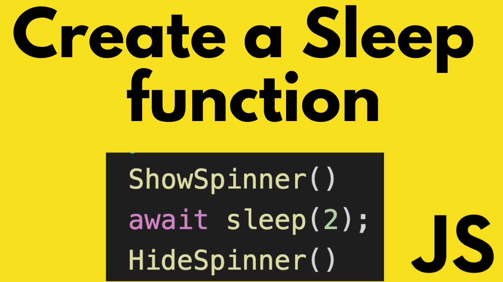

# How to make a sleep function in JavaScript with async await

YouTube Link: (coming soon)

In this video I’m going to show you how you can add a sleep function in JavaScript. Languages like .net, python and java have a method called sleep. This allows a method to pause and wait for a certain amount of time and then continue execution of its code. JavaScript does provide a setTimeout method where you can pass a function to execute after a certain amount of time. However with the addition of async and await in javascript we can write this solution in a more elegant way.

This is the solution used in the video:

  async function sleep(seconds) {
    return new Promise((resolve) => setTimeout(resolve, seconds * 1000));
  }
